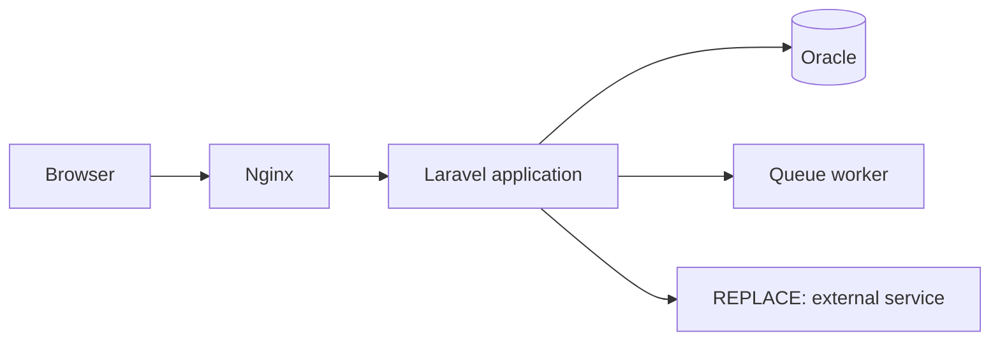

<!--
  Project README template.

  Copy to the root of a project repository as README.md and work through it.
  Delete every section that does not apply — an empty heading is worse than a
  missing one. Placeholders are marked REPLACE:.
-->

# REPLACE: Project Name

REPLACE: One sentence on what this does and who it is for. Name the domain, not
just the framework. Example: "Fee collection and reconciliation system for a
secondary school, with role-based access and monthly statements."

<!-- Screenshot goes here, before any further prose. It is the most persuasive
     element in the file. Commit it to docs/screenshots/ and use a relative path. -->


<!-- Two or three badges. Not a row of twelve. -->

[](https://github.com/daudmabena/REPLACE-repo/actions/workflows/ci.yml)
[](LICENSE)

**Live demo:** REPLACE: URL, or delete this line.

## The problem

REPLACE: Two or three sentences on what was wrong before this existed, and the
constraints that shaped the solution. This is the section that shows engineering
judgement rather than tool familiarity, and it is the one most developers skip.

## Features

- REPLACE: capability, described by what a user can do
- REPLACE: capability
- REPLACE: capability

**Not implemented yet:** REPLACE: be honest here, or delete the line. Naming the
gaps reads as confidence.

## Tech stack

| Layer | Technology |
| --- | --- |
| Backend | REPLACE: Laravel 11, PHP 8.3 |
| Frontend | REPLACE: React 19, TypeScript, Vite, Tailwind CSS |
| Database | REPLACE: Oracle 19c |
| Other | REPLACE: queue driver, cache, external services |

## Architecture

REPLACE: one short paragraph on how the pieces fit together and why it is split
this way.



<!-- More diagram patterns, including sequence and entity-relationship diagrams,
     are in github-profile/templates/architecture-diagram.md -->

## Getting started

### Prerequisites

- REPLACE: PHP 8.3 or later, with the `pdo`, `oci8` extensions
- REPLACE: Composer 2
- REPLACE: Node.js 22 or later
- REPLACE: database and version

### Installation

```bash
git clone https://github.com/daudmabena/REPLACE-repo.git
cd REPLACE-repo

composer install
cp .env.example .env
php artisan key:generate

# Set your database credentials in .env, then:
php artisan migrate --seed

npm install
npm run build
```

### Running it

```bash
php artisan serve
npm run dev      # in a second terminal, for frontend hot reload
```

REPLACE: state what success looks like. Example: "Open http://localhost:8000 and
sign in with `admin@example.test` / `password` from the database seeder."

### Configuration

Every variable the application reads is listed in `.env.example`. The ones that
must be set before it will start:

| Variable | Purpose |
| --- | --- |
| `DB_CONNECTION` | REPLACE: |
| `DB_HOST` | REPLACE: |
| REPLACE: | REPLACE: |

REPLACE: note any variable that needs an external account, such as sandbox
payment credentials, and how to obtain one.

## Testing

```bash
php artisan test
```

REPLACE: one line on what the tests cover, and anything they deliberately do not.

## API documentation

REPLACE: delete this section if the project has no API.

The full specification is in [`openapi.yaml`](openapi.yaml). Summary:

- **Base URL:** `REPLACE: https://example.test/api/v1`
- **Authentication:** REPLACE: bearer token, how to obtain one
- **Errors:** REPLACE: the standard error envelope, once, with an example

| Method | Endpoint | Purpose |
| --- | --- | --- |
| `GET` | `/REPLACE` | REPLACE: |
| `POST` | `/REPLACE` | REPLACE: |

Example:

```http
POST /api/v1/REPLACE
Authorization: Bearer <token>
Content-Type: application/json

{ "REPLACE": "value" }
```

```json
{ "data": { "id": 1, "REPLACE": "value" } }
```

Failure case:

```json
{ "message": "The given data was invalid.", "errors": { "REPLACE": ["is required"] } }
```

## Project structure

```
REPLACE: annotate only the directories that carry meaning
app/
  Http/Controllers/     REPLACE:
  Services/             REPLACE:
  Models/               REPLACE:
database/migrations/    REPLACE:
resources/js/           REPLACE:
tests/                  REPLACE:
```

## Roadmap

- [ ] REPLACE: planned work
- [ ] REPLACE: known limitation to address

## Licence

REPLACE: MIT — see [LICENSE](LICENSE).

<!-- If any part of this project is derived from someone else's work, credit it
     here with a link and its licence. Non-negotiable. -->
