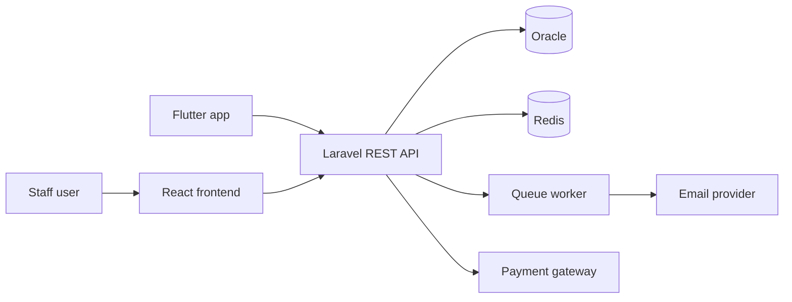
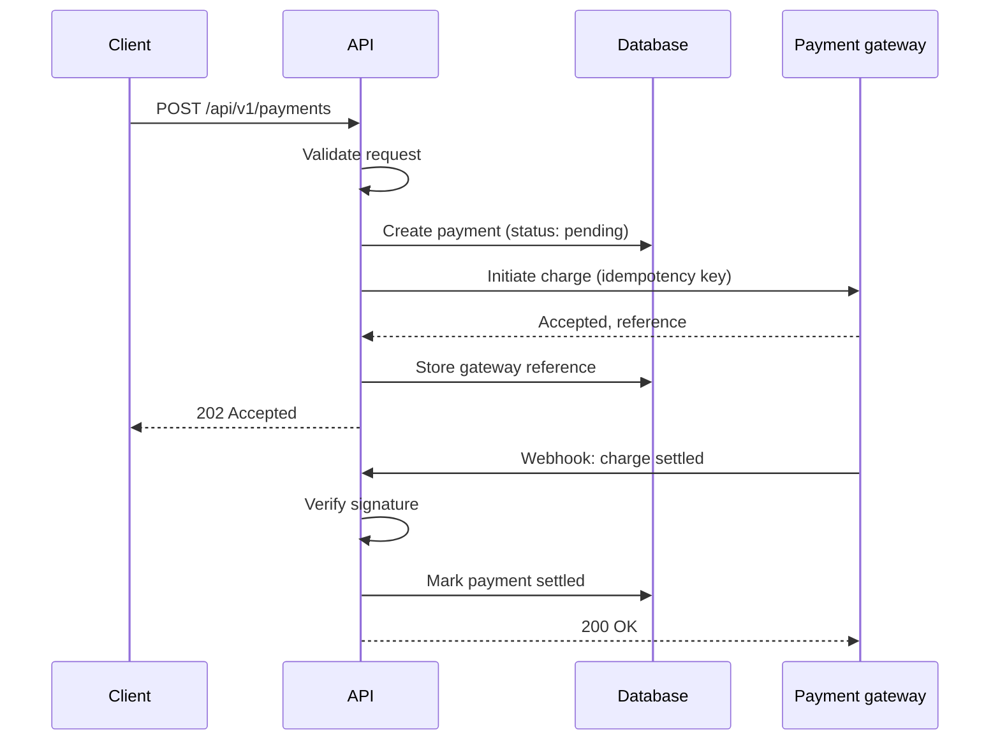
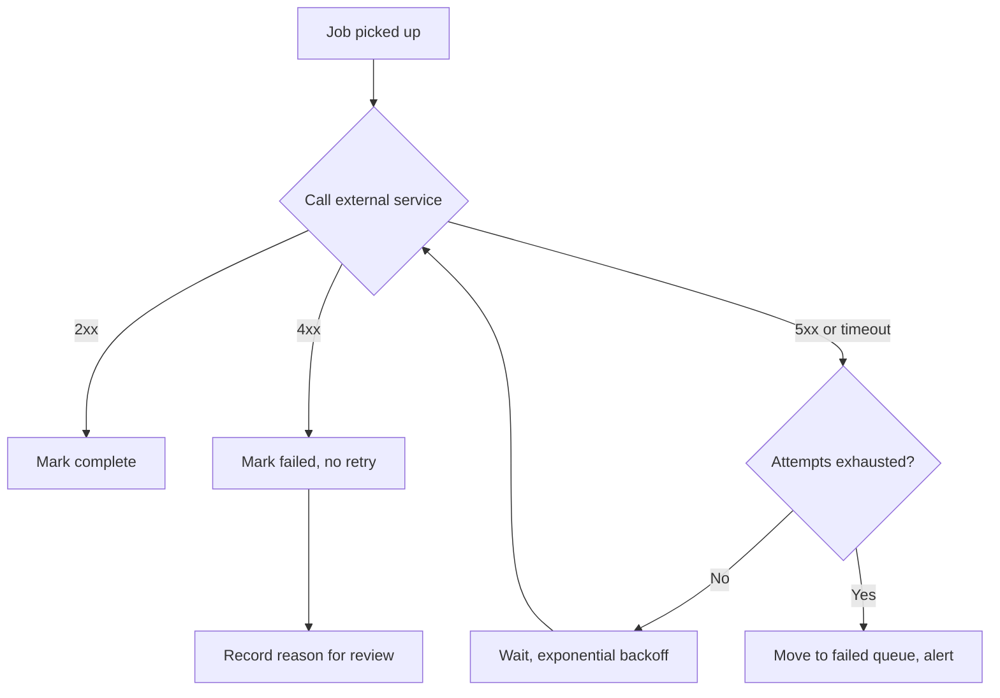
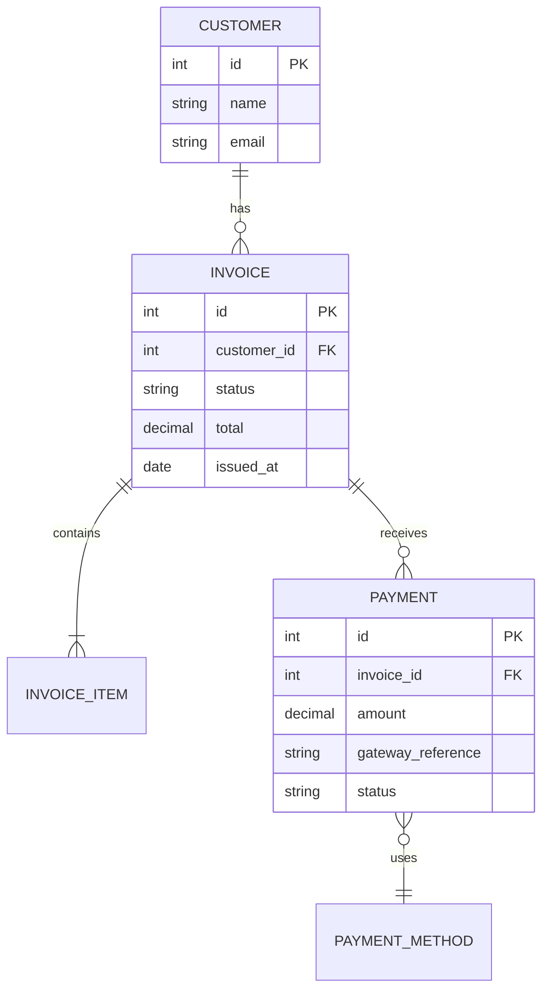
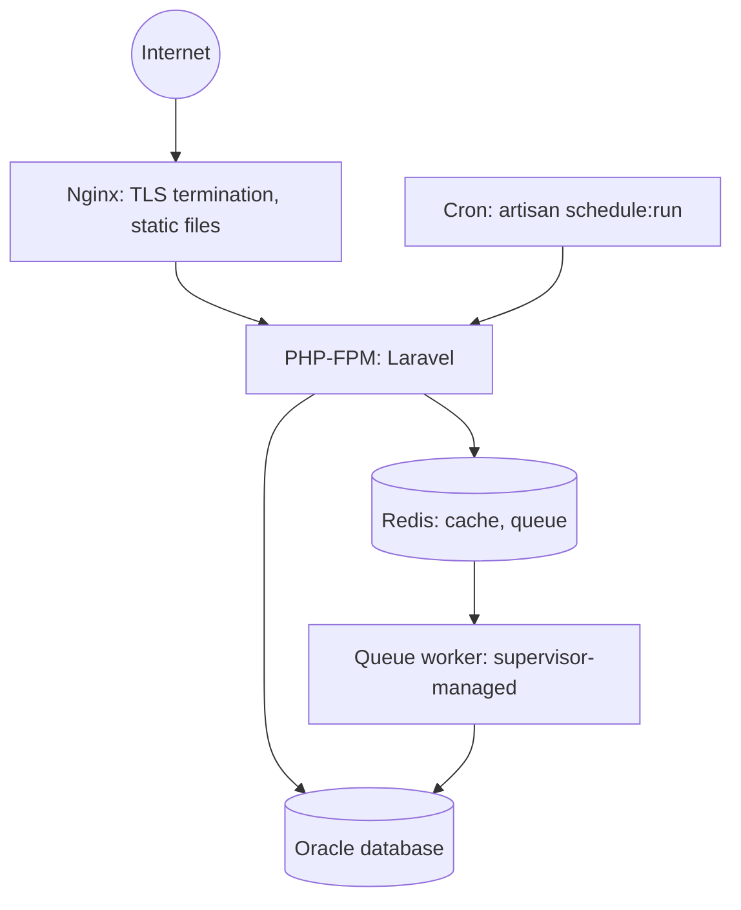

# Architecture diagram patterns

Mermaid diagrams for project READMEs. GitHub renders these natively, so they live
in version control as editable text — no design file to lose, and a reviewer can
see them without leaving the page.

Copy the fenced block you need into your README and edit the labels. Keep each
diagram to one idea; two clear diagrams beat one that shows everything.

---

## 1. System context

Draw this for every non-trivial project. It answers "what talks to what" in about
five seconds.

---

## 2. Request flow

A sequence diagram for the one genuinely interesting path. For integration and
payment work this is the diagram that carries the most weight, because it shows
you have thought about ordering and confirmation rather than just wiring calls.

Note what this communicates without a word of prose: idempotency, a pending state
before confirmation, signature verification on the inbound webhook, and
acknowledgement so the provider stops retrying.

---

## 3. Failure and retry path

Worth drawing separately when reliability is the point of the system. Most READMEs
only ever document the happy path.

---

## 4. Data model

An entity-relationship diagram of the core tables. Show the central five to ten,
never all sixty — the point is to convey the shape of the domain.

---

## 5. Deployment

Where your Linux, Nginx, and server administration experience becomes visible
rather than merely asserted.

---

## Notes

- Keep node labels short. Long labels wrap badly and make the diagram unreadable
  on a phone.
- Mermaid dislikes unquoted parentheses and colons in labels. Wrap awkward text in
  double quotes: `A["Auth service (v2)"]`.
- Check rendering in both GitHub light and dark themes before committing.
- A Mermaid diagram is not accessible to a screen reader, so make sure the
  paragraph beside it conveys the same information in words.
- Never put real hostnames, internal IP addresses, or client names in a diagram
  you publish.
